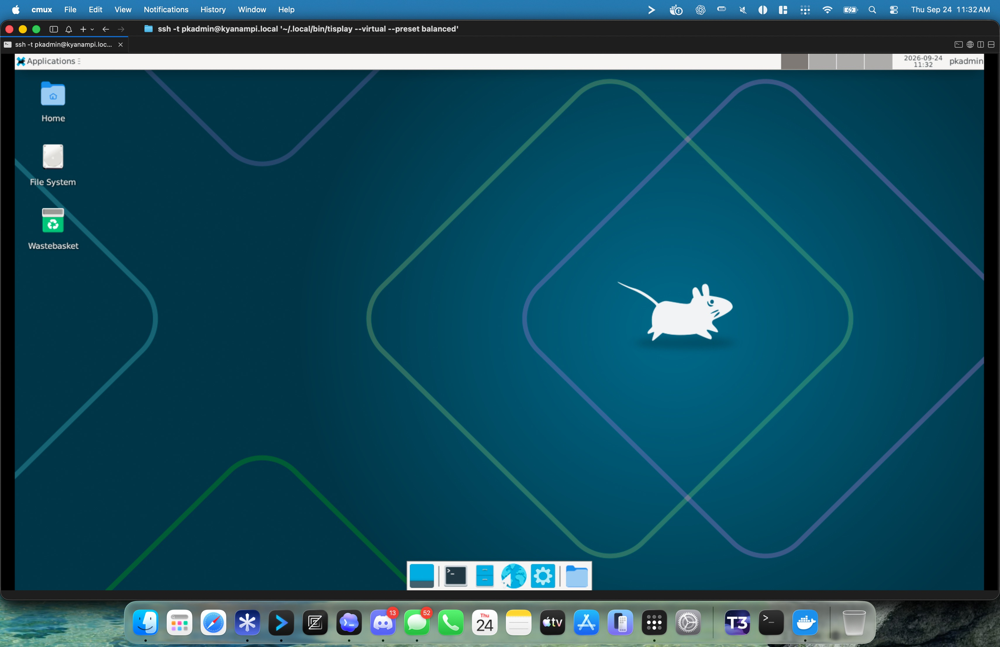

<div align="center">

<h1> tisplay</h1>

**See and control a computer's desktop from your terminal—even over SSH.**

[Project site](https://pkyanam.github.io/tisplay/) · [Agent quickstart](https://pkyanam.github.io/tisplay/agents/) · [Source and issues](https://github.com/pkyanam/tisplay) · [Releases](https://github.com/pkyanam/tisplay/releases)

[](https://github.com/pkyanam/tisplay/actions/workflows/linux-desktop.yml)
[](LICENSE)
[](https://www.python.org/)

[Install](#install) · [Usage](#usage) · [Presets](#presets) · [Options](#options) · [Development](#development)



*A remote desktop streamed inline in Cmux over SSH.*

</div>

## Install

Run this on the computer whose desktop you want to access. The installer places `tisplay` in `~/.local/bin`. Its default `virtual` profile installs the Xvfb/XFCE fallback. Choose `native` to install the managed labwc/Wayland provider tools; on Raspberry Pi OS, the desktop session package is added when available from the configured apt sources. Choose `minimal` for Python prerequisites only.

```sh
curl -fsSL https://github.com/pkyanam/tisplay/raw/refs/heads/main/install.sh | bash
```

To select a different Linux dependency profile, pass the option to Bash:

```sh
curl -fsSL https://github.com/pkyanam/tisplay/raw/refs/heads/main/install.sh | bash -s -- --profile native
```

Update an existing installation on the computer that runs it:

```sh
tisplay update --check
tisplay update
tisplay update --rollback
```

`--check` reads the current GitHub revision and does not change files. Updates build a pinned source revision into a separate release, reuse installed Python dependencies where possible, and switch the active release only after validation. Running sessions are not restarted; start a new session after updating. `--rollback` switches to the previous valid release. Source archives are fetched over HTTPS and recorded with a local SHA-256; GitHub does not publish a signed checksum for these source archives, so this is not a publisher signature. To update a remote computer, run `tisplay update` there over SSH.

From a computer that already has SSH access, `tisplay --host user@computer update --check` and `tisplay --host user@computer update` run the updater on the remote host without opening a port.

## Usage

Start a local session with:

```sh
tisplay
```

Or run it on a remote computer over SSH:

```sh
ssh -t user@computer '~/.local/bin/tisplay'
```

If `~/.local/bin` is on the remote account's `PATH`, you can use `ssh -t user@computer 'tisplay'` instead. The SSH session carries the stream and input; `tisplay` does not open a network port or require a shared filesystem.

`Ctrl-]` exits `tisplay`. Keyboard input, clicks, pointer movement, and scrolling are forwarded to the desktop. `Ctrl-C` is sent to the desktop as a key chord.

### Displays and terminals

On Linux, `tisplay` automatically selects an available supported desktop, then uses the installed virtual fallback when no native display is available. Use `--native` to require a supported existing native desktop, `--native-headless` to create or use an isolated headless Wayland compositor, or `--virtual` to force a private Xvfb/XFCE desktop. Existing native sessions are reused without changing the system compositor. Append `--` and a command to launch an application in a virtual desktop:

```sh
ssh -t user@server '~/.local/bin/tisplay --virtual -- firefox --no-remote'
```

Native Wayland support depends on the active compositor, installed tools, and reported capabilities. `--native-headless` can start an isolated labwc/D-Bus session when needed; it does not replace or reconfigure the system desktop. On macOS, use a logged-in desktop and grant your terminal or Python **Screen Recording** and **Accessibility** permissions when prompted; macOS has no virtual-display mode.

Kitty Graphics Protocol terminals, including Ghostty-based Cmux, show full-color losslessly compressed frames inline. Other terminals use an ANSI true-color half-block renderer, which fits two vertical pixels into each character cell. For detailed images, the SSH client's terminal must support Kitty graphics; otherwise `--graphics ansi` selects the compatible fallback.

## Presets

The default `balanced` preset targets up to 60 fps, starts a 1600×900 virtual desktop, and caps Kitty capture at 1600 pixels wide. `quality` starts a 1920×1080 virtual desktop, keeps the source resolution, and uses stronger lossless compression. `fast` starts a 1280×800 virtual desktop, caps capture at 960 pixels wide, and targets 30 fps. Kitty output is lossless by default; `--stream-quality high|medium|low` reduces RGB precision to lower frame size and CPU/network time, at a visible color-detail cost. The levels retain 7, 6, or 5 bits per color channel (lossless retains all 8 bits). For example, try `tisplay --preset balanced --stream-quality low`, or `tisplay attach --session ID --fps 60 --stream-quality low`. In a synthetic 1600×900 encode-only benchmark, low averaged 16.8 ms and 690 KiB per frame versus 21.2 ms and 1,348 KiB lossless; capture, SSH, and terminal rendering are excluded. This can help bandwidth-bound links, but does not guarantee 60 fps when another stage is the bottleneck.

These are starting values: explicit `--fps`, `--max-width`, `--width`, and `--height` options override them. The refresh rate is a target; capture speed, desktop motion, compression, terminal redraws, and SSH bandwidth determine the delivered rate. The loop does not queue multiple frames, but slow capture or terminal writes can still delay input. Lossless zlib settings trade CPU time for bandwidth; `--stream-quality` trades color precision for smaller Kitty frames.

## Options

```text
--graphics auto|kitty|ansi   renderer selection (default: auto)
--preset quality|balanced|fast performance and resolution defaults (default: balanced)
--fps N                     refresh target, 1 to 60 (default comes from preset)
--max-width PX              capture width cap (default comes from preset)
--stream-quality MODE       lossless (default), high, medium, or low Kitty color precision
--virtual                   force a full Xfce desktop on Xvfb (Linux)
--native                    require a supported existing native desktop
--native-headless           use an isolated headless Wayland desktop
--test-pattern              show synthetic color fields without desktop access
--width PX --height PX      virtual desktop size (default comes from preset)
```

To check terminal graphics without opening a desktop, run `tisplay --test-pattern`. It displays four color fields through the selected renderer; press `Ctrl-]` to quit.

Automation can select `session start --mode auto|native-existing|native-headless|virtual`; the `--virtual`, `--native`, and `--native-headless` aliases remain available. Use `tisplay attach --view-only` to watch a session without input control. Check `tisplay capabilities` on the target before relying on a backend or operation: compositor and output support varies by machine.

Upgraded clients use a new engine socket generation so a daemon from an older installation can keep serving existing attached viewers. After upgrading, start a new session to use the new client and native features; old session IDs remain with the old daemon until it is stopped.

### Optional Cua Driver

Tisplay can host the pinned Cua Driver 0.28.2 inside a session. The binary is optional and downloaded only when requested; Linux x86_64 and ARM64 archives are checked against the checksums published with the [0.28.2 release](https://github.com/trycua/cua/releases/tag/cua-driver-rs-v0.28.2). For Linux accessibility trees, install the platform prerequisites (`at-spi2-core` and `libxi6` on Debian-based systems) and use an accessible desktop session.

```sh
tisplay --host user@computer cua install
tisplay --host user@computer cua tools
tisplay --host user@computer cua describe get_window_state
tisplay --host user@computer cua call --session SESSION list_windows
tisplay --host user@computer cua call --session SESSION get_window_state \
  --args '{"pid":123,"window_id":456}' --out state.png
tisplay --host user@computer cua call --session SESSION click \
  --args '{"pid":123,"window_id":456,"element_token":"…","snapshot_id":"s…"}'
```

The element token and snapshot ID come from the preceding `get_window_state` response. Tisplay reuses a private per-session Unix socket so those references survive separate CLI calls, and stops its owned Cua process when the Tisplay session stops. `--out` writes screenshots on the computer running the command; default output omits image bytes. `tisplay --host user@computer cua mcp --session SESSION` bridges the persistent MCP stdio stream over SSH without opening a remote TCP listener. Cua support is experimental and desktop-specific: semantic AT-SPI access is verified on Linux X11, while native labwc accessibility is not yet verified. Check `cua doctor` and the target's accessibility services before relying on element actions. `--raw` prints the complete driver result, including large image data when returned.

## Development

```sh
python3 -m venv .venv
. .venv/bin/activate
python3 -m pip install -e '.[linux]'
python3 -m pytest
```

Automated tests cover stream encoding and input mapping. Hardware capture, platform permission prompts, and live Cmux rendering require a real display and terminal.

See [CONTRIBUTING.md](CONTRIBUTING.md) for contribution guidance and [SECURITY.md](SECURITY.md) to report a vulnerability.
